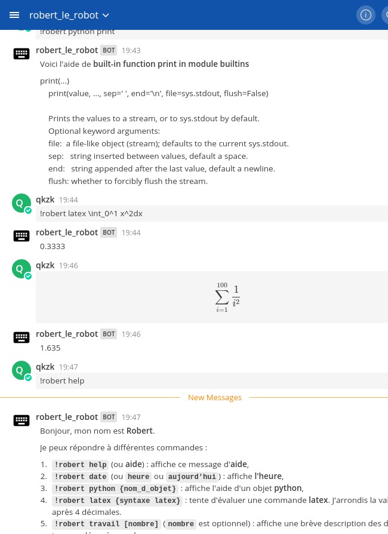

# Robert le robot



## Présentation

**Robert le robot** est un bot en python pour [Mattermost](https://mattermost.org).
Il peut répondre à différentes commandes.

## Superpouvoirs de Robert


* [x] **`!robert help`** (ou **aide**) : affiche ce message d'**aide**,
* [x] **`!robert date`** (ou **`heure`** ou **`aujourd'hui`**) : affiche **l'heure**,
* [x] **`!robert python {nom_d_objet}`** : affiche l'aide d'un objet **python**,
* [x] **`!robert latex {syntaxe latex}`** : tente d'évaluer une commande **latex**. La valeur est arrondie après 4 décimales.
* [x] **`!robert travail [nombre]`** (**`nombre`** est optionnel) : affiche une brève description des derniers travaux déposés sur classroom.
* [x] **`!robert session \@username`** : affiche des infos sur le compte : dernière connexion etc. (_System Admin Only_)
* [x] **`!robert clear`** : efface tous les messages d'un canal. Demande une confirmation par `!robert confirmer` (_System Admin Only_)
* [x] **`!robert delete @username`** : efface tous les messages d'un utilisateur sur les canaux publics auxquel il a accès. Demande une confirmation par `!robert confirmer` (_System Admin Only_)
* [ ] d'autres idées... parmi lesquelles : exécuter un script python, "panic mode : révoquer toutes les sessions", nettoyer tous les posts ayant plus de tel age dans la bdd, rendre silencieux un utilisateur,

Il reconnait aussi la syntaxe latex :

\`\`\`latex
```latex
\sum i={1}^{100} \frac{1}{2^i}
```
\`\`\`


## Librairies :

* [mattermostdriver](https://github.com/Vaelor/python-mattermost-driver) permet de contrôler le bot et de créer des webhooks
* [pyaml](https://pypi.org/project/PyYAML/) pour lire les fichiers de configuration
* [google classroom](https://developers.google.com/classroom/quickstart/python)
* [sympy](https://www.sympy.org/en/index.html) pour évaluer les commandes latex. Ce parser nécessite aussi [antlr4-python3-runtime](https://pypi.org/project/antlr4-python3-runtime/)


## Créer un bot pour mattermost

L'aide de Mattermost [ici](https://docs.mattermost.com/developer/bot-accounts.html)  et [là](https://docs.mattermost.com/developer/bot-accounts.html#bot-account-creation) explique comment créer un bot.

Il faut d'abord autoriser la création de bots ainsi que [celles de webhook](https://docs.mattermost.com/developer/webhooks-outgoing.html),
qui permettent au bot de lire les messages d'un canal.

**Robert** répond à la fois aux messages privés et aux messages publics sur un canal.

## Configurer robert

Deux méthodes :

1. **automatiquement** : exécuter le script [configure_robert.py](./configure_robert.py) et laissez-vous guider.
2. **manuellement** : suivre une à une toutes les étapes suivantes.

Les étapes 1 et 2 suffisent à utiliser les fonctions de base de Robert (sans classroom).
Les étapes suivantes permettent d'utiliser l'API de google classroom.


1. **Token** Robert est un bot, Mattermost permet aux bot de s'identifier directment par un token, sans utiliser d'email.

    1. **Créer un compte de bot** directement dans la console système de votre serveur. **Copier le token**.
    2. **Écrire le token** dans [token.robert](./config/token.robert)
    3. **AJOUTER ROBERT AUX TEAMS**. Si le bot n'est pas dans une équipe, il ne pourra y poster. Cela se fait directement sur le serveur.
    4. **Copier le nom d'utilisateur** que vous avez donné à Robert.

       S'il est différent de `robert_le_robot`, modifiez la variable `BOT_USERNAME` dans [display_teams.py](./display_teams.py)

2. **paramètres du serveur** Ils sont à écrire dans [config.yml](./config/config.yml)

    Modifiez l'adresse et le port en respectant le format suivant :

    ~~~yaml
    basepath: /api/v4
    debug: true
    port: 443
    url: adresse.du.serveur
    ~~~

3. **credentials.json** Ce sont les autorisations générales du compte google classroom.

    Suivez le tutoriel de google classroom et copiez les dans [credentials.json](./config/credentials.json).
    Attention, pour éviter d'encombrer le dossier racine, l'adresse par défaut du tutoriel a été changée.

4. **token.pickle** C'est le token crée par google. Chaque niveau d'autorisation (lecture, édition et 20 variantes) correspond à un token.pickle différent. Le fichier est automatiquement crée par google. Si vous souhaitez adapter le bot et lui ajouter / retirer des autorisations il faut effacer ce fichier. Lors du lancement du bot, vous verrez un lien dans la console. Ouvrez le dans le navigateur,
cliquez oui (ou non si vous ne voulez pas mais alors pourquoi vous lisez ça ?) et le script va créer le fichier automatiquement.

    La configuration par défaut est "lecture et écriture des **devoirs**, pas des classes".

5. **team_classroom.yml** C'est le plus pénible.

    Ce fichier fait l'association entre une équipe (mattermost) et une classe (classroom).
    Pour l'adapter il faut récupérer les bonnes id des équipes.

    Deux méthodes pour remplir ce fichier.

    1. _Automatiquement_ : **Exécuter le fichier** (méthode recommandée) [associate_team_classroom.py](.\associate_team_classroom.py)

        Suivez les instructions à l'écran. La dernière étape vous propose de valider ce que vous avez fait.
        Vous pouvez recommencer ce processus à tout moment.
        Le script réalise les étapes suivantes tout seul et vous propose soit de saisir les `id_classroom`
        Soit de les trouver lui-même à partir d'un mot clé. Ouvrez une page vers [classroom](https://classroom.google.com) afin de copier les noms exacts.


    2. _Avec un peu d'aide._ (si vous n'avez pas confiance)

        1. **Exécuter le fichier** [display_teams.py](.\display_teams.py). Attention, vous devez déjà avoir configuré le bot (étapes 1 à 4).

            Les noms des équipes ainsi que les `team_id` apparaissent à l'écran. Copiez les `team_id` qui vous intéressent.

            **Attention** dans l'étape 1, vous devez avoir été jusqu'au bout et avoir ajouté Robert aux bonnes équipes. Vous ne verrez que les équipes contenant Robert !

        2. **Exécuter le fichier** [display_classroom_courses.py](.\display_classroom_courses.py).

            Il affiche tous les noms et `course_id` des classes accessibles par votre compte.
            Malheureusement, le niveau d'autorisation pour afficher les courses est différent de celui pour manipuler
            les travaux d'une classe. Il faut donc recréer un fichier token.pickle pour ce niveau.
            Ce processus est heureusement automatisé. Il suffit de cliquer le lien, autoriser dans le navigateur et laisser faire.

            Si vous avez un compte administrateur GSuite, vous verrez toutes les classes de l'établissement !

        3. **copiez les `courses_id`** dans le fichier [team_classroom.yml](`team_classroom.yml`)

          Ce fichier _yaml_ doit respecter un format particulier :

          ```yaml
          'team_id_1': 'course_id_1'
          'team_id_2': 'course_id_2'
          'team_id_3': 'course_id_3'
          ```

      Afin de vérifier, connectez-vous à mattermost et, **pour chaque team**, demandez le travail avec `!robert travail`
